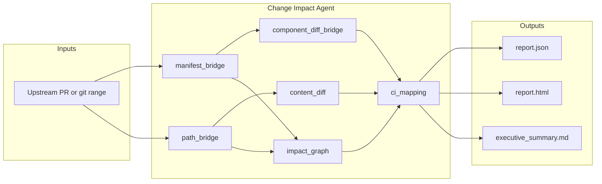

# AGENTS_030 — Change Impact Agent (5-Slide Deck)

Copy each slide into PowerPoint, Google Slides, or Gamma. Speaker notes are under **Notes**.

Replace `https://your-demo-video-url` after recording your demo.

---

## Slide 1 — Title & problem

# AGENTS_030 — Change Impact Agent for TheRock

**Pre-merge change briefing for ROCm superrepo PRs**

- **Problem:** TheRock PRs touch submodule pins, superrepo SHAs, CI matrices, and packaging — reviewers must manually infer blast radius and which `test:*` / `test_filter:*` labels to apply.
- **Solution:** One command (`analyze.py --pr N`) produces structured impact + CI recommendations before merge.
- **Positioning:** Advisory assistant — recommends labels; humans apply them (does not trigger CI or build ROCm).

| Manual today | With Change Impact Agent |
|--------------|--------------------------|
| Read diff, topology, CI docs | `report.json` + `report.html` + executive summary |
| Guess which test suites to run | Suggested `test:*` and `test_filter:*` labels |
| Unclear rollout scope | Severity score + rollout guidance |

> **Notes:** Open with the pain point: superrepo PRs are hard to triage. Emphasize this is a **briefing** tool, not an auto-CI bot. Mention AGENTS_030 / AMD TCS hackathon context if required.

---

## Slide 2 — Expected impact & value

# Expected impact & value

| Benefit | How |
|--------|-----|
| **Saves reviewer time** | Auto-summarizes manifest, paths, superrepo components, and CI file content |
| **Reduces CI waste** | Suggests targeted `test:miopen`, `test:hipdnn`, etc. instead of default all-suites (`PROJECTS_TO_TEST=*`) |
| **Faster feedback** | Rollout guidance (canary one gfx family + component labels) before full `multi_arch_ci` |
| **Lower risk** | Severity score + affected build stages from `BUILD_TOPOLOGY.toml` |
| **Reusable artifacts** | JSON for tooling, HTML for humans, markdown summary for PR discussion |

**Validated on real `ROCm/TheRock` PRs:**

| PR | Agent recommendation |
|----|----------------------|
| [#5572](https://github.com/ROCm/TheRock/pull/5572) | `test:miopen`, `test_filter:quick` — GHA timeout 60→120 min |
| [#5688](https://github.com/ROCm/TheRock/pull/5688) | `test:hipdnn`, `test_filter:quick` — CI + artifact TOML |
| [#5480](https://github.com/ROCm/TheRock/pull/5480) | `test_filter:quick` — third-party packaging |
| [#5718](https://github.com/ROCm/TheRock/pull/5718) | Component-scoped `test:*` — rocm-libraries superrepo bump |

**Pitch:** Minutes of manual triage → seconds of automated briefing per PR.

### Pre-merge + post-failure loop

| Phase | Agent | Command |
|-------|-------|---------|
| **Before merge** | Change Impact | `analyze.py --pr N` |
| **After CI failure** | Log Analysis | `analyze_log.py --log job.log --preset therock_multi_arch` |

Both agents emit `report.json`, `report.html`, and an executive summary — same artifact pattern for reviewers.

**Post-failure automation:** When Multi-Arch CI (or other monitored workflows) fail on the fork, `log-analysis-agent.yml` downloads job logs and uploads a triage report artifact (optional PR comment).

> **Notes:** Tie benefits to productivity and CI cost. Point to `sample-runs/` on GitHub as evidence — no live demo required for this slide.

---

## Slide 3 — Innovation & key differentiators

# Innovation / key differentiators

1. **Multi-layer analysis pipeline** (not just manifest diff):
   - Submodule pins → superrepo GitHub compare + per-directory commits → TheRock path diff → CI matrix / TOML parsers → topology blast radius → CI label mapping.

2. **Component-scoped CI labels** for superrepo bumps — maps `rocm-libraries` SHA changes to specific suites (`miopen`, `hipblaslt`, …), not a blanket "run all math-libs tests".

3. **PR-first upstream workflow** — `--pr N` fetches `ROCm/TheRock` pull head and merge-base; works from fork clones (`upstream-main` auto-fetch).

4. **Complements existing tooling** — `manifest-diff.yml` runs in CI; this agent **briefs reviewers pre-merge** and complements assistant-librarian (creates bump PRs; this **analyzes any PR**).

5. **Optional LLM layer** — template summaries by default; `summarize.py` supports Ollama / vLLM (MI300) without changing core analysis. **LLM guardrails:** system prompt + label/severity validation + template fallback if the model invents facts.

> **Notes:** Walk the diagram left-to-right. Stress differentiator #2 for superrepo bumps (#5718). Optional LLM is a nice MI300 story without being required for core value. Mention guardrails: *generative layer is constrained; authoritative JSON wins.*

---

## Slide 4 — Demo

# Demo

- **Notebook:** `notebook/hackathon_demo.ipynb` — clone fork, `pytest`, analyze PRs #5572, #5688, #5480, #5718.
- **CLI:** `python analyze.py --pr 5572` → open `out/pr-5572/report.html`.
- **Sample outputs (no local run):** browse [`sample-runs/`](sample-runs/) — `report.html` and `executive_summary.md` for each demo PR.
- **GitHub Actions (fork):** `change-impact-agent.yml` (PR comments), `change-impact-upstream-scan.yml` (dispatch upstream scan + artifact).

**Demo video:** https://your-demo-video-url

Recommended recording (3–5 min): notebook section 5 + open `sample-runs/pr-5572/report.html` (severity, labels, rollout).

**Screenshots to capture:** executive summary for #5572; component list for #5718; CI recommendations block in HTML report.

> **Notes:** If live demo fails, fall back to sample-runs on GitHub. Show one HTML report fullscreen — that's the "wow" moment.

---

## Slide 5 — Future work & resources

# Future work & resources

| Phase | Item |
|-------|------|
| Near-term | Merge to `ROCm/TheRock`; richer PR comments (link to HTML artifact) |
| Near-term | PAT + `--full-manifest` in Actions for reliable superrepo drill-down |
| Medium | Scheduled upstream PR scan; optional label application with maintainer gate |
| Longer | Per-ctest mapping; deeper integration with `multi_arch_ci` canary jobs |

**Limitations:** Recommendations only; superrepo depth needs `GITHUB_TOKEN`; not a replacement for full ROCm build CI.

### Links

| Resource | URL |
|----------|-----|
| **Code (agent)** | https://github.com/rajipsv/TheRock/tree/feature/change-impact-agent/agents/change-impact-agent |
| **Repo branch** | https://github.com/rajipsv/TheRock/tree/feature/change-impact-agent |
| **Sample reports** | https://github.com/rajipsv/TheRock/tree/feature/change-impact-agent/agents/change-impact-agent/sample-runs |
| **Demo video** | https://your-demo-video-url |
| **Tests** | `pytest agents/change-impact-agent/tests/` (15 unit tests) |
| **Log analysis (post-failure)** | [log-analysis-agent](../log-analysis-agent/) — `analyze_log.py --log job.log` |

> **Notes:** End with honesty on limitations — builds trust. Mention the **pre-merge + post-failure** loop: change-impact before merge, log-analysis after CI failure. Leave Q&A open for upstream merge path and GitHub integration.
